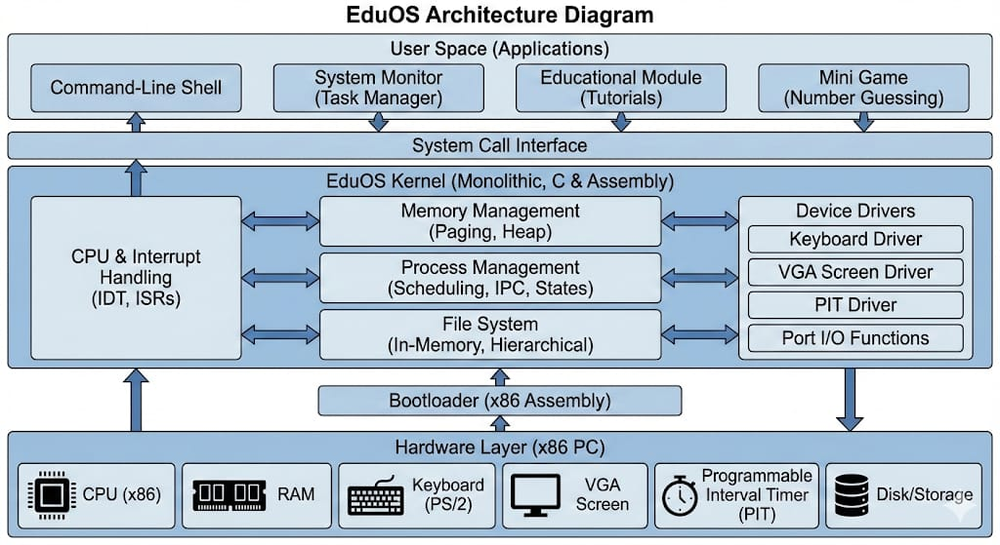

# EduOS - Educational 32-bit Operating System

A pedagogical x86 operating system demonstrating fundamental OS concepts including memory management, process scheduling, interrupt handling, device drivers, and file systems.


## Project Overview

**EduOS** is a complete 32-bit operating system built from scratch in C and x86 assembly. It boots from a custom bootloader, initializes memory management through paging and heap allocation, implements process scheduling and inter-process communication, handles hardware interrupts, and provides a functional file system with a shell interface.

**Target**: Educational demonstration of OS internals and core concepts for computer science students.

**Platform**: x86-32 (IA-32) Protected Mode

**Language**: C, x86 Assembly

**Build System**: Makefile

---

## Quick Setup & Run

### Prerequisites
- GCC cross-compiler for i386-elf (binutils+gcc built for i386-elf)
- NASM (Netwide Assembler)
- QEMU (recommended) or VirtualBox
- Make
- Optional: `xorriso` / `qemu-img` if you customize disk images
- Host: Linux/macOS/WSL (Windows users: prefer WSL)

### Environment Setup (Debian/Ubuntu/WSL example)
```bash
sudo apt update
sudo apt install -y build-essential nasm qemu-system-x86 git
# If you need a cross toolchain, build i386-elf binutils/gcc (see OSDev wiki)
```

### Build
```bash
make

# Outputs
# - os-image      (raw disk image)
# - os-image.vdi  (VirtualBox image)
```

### Run
- QEMU: `qemu-system-i386 -drive format=raw,file=os-image`
- VirtualBox: create VM (Linux → Other), attach `os-image.vdi`, boot

### Quick User Guide
- Help: `help`, `help system`, `help files`, `help process`, `help apps`
- Files: `ls`, `pwd`, `mkdir test`, `cd test`, `touch a`, `write a`, `cat a`
- Processes: `start`, `monitor` → `1/2/3`, `kill <pid>`, `msg <pid> X`, `inbox <pid>`
- Timing: `uptime`, `sleep 500`, `memmap`
- Apps: `game`, `edu`

### Troubleshooting
- QEMU missing: `sudo apt install qemu-system-x86`
- NASM missing: `sudo apt install nasm`
- Cross toolchain: ensure `i386-elf-as`, `i386-elf-ld`, `i386-elf-gcc` on PATH
- On Windows native: use WSL; native toolchains differ

---

## 🗂️ Project Structure

```
EduOS/
├── boot/                     # Bootloader & kernel entry
│   ├── boot.asm             # Stage 1 bootloader (MBR)
│   ├── kernel_entry.asm     # Entry point (calls kernel_main)
│   ├── gdt.asm              # Global Descriptor Table setup
│   ├── switch_pm.asm        # Real mode → Protected mode
│   ├── disk_load.asm        # Load sectors from disk
│   └── print_string.asm     # Real mode printing
│
├── cpu/                      # CPU-level code
│   ├── idt.c                # Interrupt Descriptor Table
│   ├── idt.h
│   └── interrupt.asm        # Interrupt Service Routines (ISRs)
│
├── drivers/                  # Hardware drivers
│   ├── keyboard.c           # PS/2 keyboard input
│   ├── keyboard.h
│   ├── screen.c             # VGA text mode display
│   ├── screen.h
│   ├── pit.c                # Timer (PIT - Programmable Interval Timer)
│   ├── pit.h
│   ├── ports.c              # I/O port operations
│   └── ports.h
│
├── kernel/                   # Core kernel
│   ├── kernel.c             # Main kernel & command shell
│   ├── types.h              # Standard integer types
│   ├── memory.c             # E820 memory map display
│   ├── memory.h
│   ├── heap.c               # Dynamic memory allocator
│   ├── heap.h
│   ├── paging.c             # Virtual memory (paging)
│   ├── paging.h
│   ├── process.c            # Process management & scheduling
│   ├── process.h
│   ├── fs.c                 # File system
│   ├── fs.h
│   ├── monitor.c            # System monitor utility
│   ├── monitor.h
│   ├── education.c          # Educational OS concepts
│   ├── education.h
│   ├── game.c               # Demo game (Guess the Number)
│   └── game.h
│
├── libc/                     # C library functions
│   ├── string.c             # String manipulation
│   └── string.h
│
├── Makefile                 # Build configuration
├── plan.txt                 # Development notes
└── README.md               # Project documentation
```

---

## ✨ Key Features

### Core OS Features
- ✅ **Protected Mode Boot** - Custom bootloader with GDT and E820 memory detection
- ✅ **Paging & Virtual Memory** - 2-level page tables with per-process isolation
- ✅ **Dynamic Memory Allocation** - Free-list heap allocator (256 KB)
- ✅ **Process Management** - Up to 10 concurrent processes with PCBs
- ✅ **Preemptive Scheduling** - Round-robin scheduler driven by timer interrupts
- ✅ **Interrupt Handling** - IDT with 256 entries, hardware interrupt support
- ✅ **File System** - Hierarchical in-memory FS with CRUD operations
- ✅ **Inter-Process Communication** - Mailbox-based message passing

### Hardware Drivers
- ✅ **Keyboard Driver** - PS/2 scancode translation, line editing, modifiers
- ✅ **VGA Text Mode Driver** - Direct memory I/O, cursor control, scrolling
- ✅ **PIT Timer Driver** - Programmable interval timer (IRQ0)
- ✅ **Port I/O Abstraction** - Low-level I/O port operations

### User-Facing Features
- ✅ **Command-line Shell** - Interactive prompt with command parsing
- ✅ **Educational Module** - Built-in OS concepts tutorial
- ✅ **System Monitor** - Live process, memory, and CPU information display
- ✅ **Game Application** - "Guess the Number" demonstrating user interaction
- ✅ **Help System** - Categorized command documentation

---

## 🏗️ System Architecture

### Layered Architecture Diagram



---

## 🔍 Technical Details
   ├─ Set CR0.PG = 1 (enable paging)
   └─ Result: Virtual memory enabled

3. init_heap()
   ├─ Initialize free_list with 256 KB block
   └─ Result: kmalloc/kfree ready

4. init_process_manager()
   ├─ Create KERNEL process (PID=1000, state=RUNNING)
   ├─ Create SHELL process (PID=1001, state=RUNNING)
   └─ Result: Process table initialized

5. init_fs()
   ├─ Create root directory (cwd="/")
   ├─ Create readme.txt with welcome message
   └─ Result: File system operational

6. init_keyboard()
   ├─ Remap PIC (IRQ1 → INT 33)
   ├─ Register isr_keyboard handler
   ├─ Unmask keyboard interrupt
   └─ Result: Keyboard input enabled

7. init_pit(1000)
   ├─ Set timer frequency to 1000 Hz (1 ms)
   ├─ Register isr_timer handler at INT 32
   ├─ Unmask timer interrupt
   └─ Result: Timer fires every 1 ms

8. Enable Interrupts
   └─ __asm__ volatile("sti");

9. Show Shell Prompt
   └─ "root@EduOS:/$ "
```

### Phase 4: Runtime Operation (Interrupt-Driven)

```
Main Event Loop:

CPU Idle
  ├──→ [IRQ0: Timer Interrupt - Every 1ms]
  │    1. isr_timer() called
  │    2. Increment ticks counter
  │    3. Call schedule_tick() → Round-robin scheduler
  │    4. Send EOI to PIC (port 0x20)
  │
  ├──→ [IRQ1: Keyboard Interrupt - On Key Press]
  │    1. isr_keyboard() called
  │    2. Read scancode from port 0x60
  │    3. Translate to ASCII (with Shift/Caps Lock handling)
  │    4. Handle special keys (Backspace, Arrows, Delete, Enter)
  │    5. Update key_buffer and cursor position
  │    6. On ENTER: Call user_input(key_buffer)
  │    7. Send EOI to PIC
  │
  └──→ [user_input() - Command Processing]
       1. Parse command and arguments
       2. Match command to handler function
       3. Execute handler (file ops, process ops, system calls)
       4. Display result via kprint()
       5. Show prompt: "root@EduOS:/$ "
       6. Return to idle
```

---

## OS Concepts Implemented

### 1. Memory Management

#### A. Paging (Virtual Memory)

**File**: `kernel/paging.c`

**What Implemented**:
- 2-level page table hierarchy
- Page Directory: 1024 entries × 4 bytes = 4 KB
- Page Tables: 4 tables × 1024 entries = 4096 mappings total
- Address translation: 10-bit dir index + 10-bit table index + 12-bit offset
- Identity mapping: Virtual == Physical for first 16 MB
- Per-process address spaces via `create_address_space()`
- Context switching via `switch_address_space()` (loads CR3)

**Key Functions**:
```c
void init_paging();                              // Enable paging
page_dir_t create_address_space();               // New process PD
void switch_address_space(page_dir_t pd_phys);   // Context switch
void map_page(page_dir_t pd, u32 virt, u32 phys, int writable);  // Map VA→PA
u32 alloc_frame();                               // Allocate 4 KB page
```

---

#### B. Heap Allocation

**File**: `kernel/heap.c`

**What Implemented**:
- Free-list allocator (linked list of blocks)
- First-fit allocation strategy
- Block splitting to reduce fragmentation
- Block coalescing on free to prevent fragmentation
- 256 KB total heap
- Block metadata: size, free flag, next pointer

**Key Functions**:
```c
void init_heap();           // Initialize empty heap
void* kmalloc(u32 size);    // Allocate memory
void kfree(void* ptr);      // Free memory
```

**Internal Functions**:
```c
void split_block(Block* blk, u32 size);  // Split oversized block
void coalesce();                          // Merge adjacent free blocks
```

**How to Demonstrate**:
```bash
touch file1.txt             # Allocate FileNode
mkdir dir1                  # Allocate another node
touch file2.txt
rm file2.txt                # Free node (coalesce)
ls                          # List remaining
```

---

### 2. Process Management

#### A. Process Scheduler

**File**: `kernel/process.c`

**What Implemented**:
- Process Control Block (PCB) structure with:
  - PID, name, state, memory usage
  - CPU context (eax, ebx, ecx, edx, esp, ebp, esi, edi)
  - Page directory (cr3) for address space isolation
  - IPC mailbox (128-byte circular buffer)
- Round-robin scheduler (`schedule_tick()` called by timer)
- Process states: READY, RUNNING, BLOCKED, TERMINATED
- Process table: array of 10 max processes

**Key Functions**:
```c
void init_process_manager();      // Create KERNEL & SHELL
void create_process(char* name, int memory);  // New process
void list_processes();            // Display process table
void terminate_process(int pid);  // Kill process
void schedule_tick();             // Round-robin scheduling (called by timer)
```

---

#### B. Inter-Process Communication (IPC)

**File**: `kernel/process.c`

**What Implemented**:
- Mailbox IPC model
- Each process has 128-byte circular buffer
- Send message: `send_message(pid, char)`
- Receive message: `recv_message(pid, &char)`
- Head/tail pointers for circular queue management

**Key Functions**:
```c
int send_message(int pid, char c);     // Send 1-byte message
int recv_message(int pid, char* c);    // Receive 1-byte message
```


### 3. Interrupt Handling

#### A. Interrupt Descriptor Table (IDT)

**File**: `cpu/idt.c` + `cpu/interrupt.asm`

**What Implemented**:
- IDT structure with 256 entries (32 exceptions + 224 interrupts)
- Each entry: offset (16 bits lo + 16 bits hi), selector, flags
- Gate types: Interrupt gates (disable IF during handler)
- PIC remapping: IRQ0-15 → INT 32-47 (avoid CPU exceptions)
- EOI (End of Interrupt) protocol

**Key Functions**:
```c
void set_idt_gate(int n, u32 handler);  // Set IDT entry
void set_idt();                          // Load IDT into CPU
```

**Interrupt Mapping**:
```
IRQ0 (Timer)    → INT 32  (isr_timer)
IRQ1 (Keyboard) → INT 33  (isr_keyboard)
INT 0-31 reserved for CPU exceptions
```


#### B. Timer Interrupt (PIT - Programmable Interval Timer)

**File**: `drivers/pit.c`

**What Implemented**:
- Configure PIT frequency via ports 0x43 (control), 0x40 (data)
- Divisor formula: 1193182 / desired_frequency
- Tick counter (volatile u32) incremented on each IRQ0
- pit_sleep() for millisecond-precision delays
- Scheduler integration: calls `schedule_tick()` on each interrupt

**Key Functions**:
```c
void init_pit(u32 frequency);      // Initialize with frequency
void isr_timer_handler(u32* regs);  // IRQ0 handler
u32 pit_ticks();                    // Get current tick count
void pit_sleep(u32 ms);             // Sleep N milliseconds
```

#### C. Keyboard Interrupt (IRQ1)

**File**: `drivers/keyboard.c`

**What Implemented**:
- Scancode-to-ASCII translation via lookup table
- Modifier key tracking: Shift, Caps Lock (with XOR logic)
- Extended scancode handling (0xE0 prefix for arrow keys)
- Line editing: Backspace, Delete, arrow navigation, cursor positioning
- Character insertion/deletion at cursor (not just append)
- Input buffer: 256 bytes with cursor position tracking

**Key Functions**:
```c
void isr_keyboard_handler();   // IRQ1 handler
void init_keyboard();          // Setup keyboard interrupt
```


### 4. Device Drivers

#### A. VGA Text Mode Screen Driver

**File**: `drivers/screen.c`

**What Implemented**:
- Direct memory writes to 0xB8000 (VGA text buffer)
- 80×25 character grid in text mode
- Character format: ASCII (1 byte) + attribute (1 byte)
- Cursor control via CRT controller ports (0x3D4/0x3D5)
- Auto-scrolling when text exceeds screen height
- Scrolling algorithm: shift rows up, clear last line

**Key Functions**:
```c
void kprint(char* message);                    // Print at cursor
void kprint_at(char* msg, int col, int row);   // Print at position
void clear_screen();                           // Clear & reset cursor
int get_cursor_offset();                       // Read cursor position
void set_cursor_offset(int offset);            // Write cursor position
void kprint_backspace();                       // Delete character
void kprint_move_cursor(int direction);        // Move ±1 position
int handle_scrolling(int cursor_offset);       // Auto-scroll
```

#### B. Port I/O Abstraction Layer

**File**: `drivers/ports.c`

**What Implemented**:
- `port_byte_in(port)`: Read byte from I/O port
- `port_byte_out(port, data)`: Write byte to I/O port
- Inline x86 assembly for `in`/`out` instructions

**Key Functions**:
```c
unsigned char port_byte_in(unsigned short port);
void port_byte_out(unsigned short port, unsigned char data);
```

---

### 5. File System

**File**: `kernel/fs.c`

**What Implemented**:
- Hierarchical directory structure (/, /home/, /data/, etc.)
- Inode-like FileNode structure with:
  - Full path string
  - Data payload (1024 bytes max)
  - Type: FS_FILE or FS_DIR
  - Size and linked list pointer
- Path resolution: absolute (`/home/file.txt`) and relative (`file.txt`)
- Parent directory navigation (`cd ..`)
- Current working directory (cwd) tracking
- Linked list storage in heap memory

**Key Functions**:
```c
void init_fs();                          // Initialize root
void fs_list();                          // List current directory
int fs_create(char* name);               // Create file
int fs_mkdir(char* name);                // Create directory
int fs_cd(char* path);                   // Change directory
void fs_pwd();                           // Print working directory
int fs_write(char* name, char* data);    // Write file contents
void fs_read(char* name);                // Read file contents
void fs_delete(char* name);              // Delete file
void fs_copy(char* src, char* dest);     // Copy file
void fs_rename(char* src, char* dest);   // Rename file
```


## Memory Layout

### Physical Memory

```
0x00000000 - 0x00001000   │ Reserved (BIOS, interrupt vectors)
0x00001000 - 0x00010000   │ Free
0x00010000 - 0x00050000   │ Kernel Code & Data
0x00050000 - 0x00051000   │ E820 Memory Map (from bootloader)
0x00051000 - 0x00100000   │ Free
0x00100000 - 0x00140000   │ Kernel Heap (256 KB)
0x00140000 - 0x00141000   │ Page Directory
0x00141000 - 0x00145000   │ Page Tables (4 KB × 4)
0x00145000 - 0x9FFFFFFF   │ Free (for processes, modules, etc.)
0xB8000    - 0xB8FA0      │ VGA Text Buffer (80×25 chars)
0xFEC00000 - 0xFED00000   │ APIC (advanced interrupt controller)
```

### Virtual Address Space (Per Process)

```
0xFFFFFFFF ┌─────────────────────────────────┐
           │ High Kernel (shared)            │
           │ (kernel code, interrupt stubs)  │
           ├─────────────────────────────────┤
           │                                 │
           │ (Guard page - unmapped)         │
           │                                 │
0x01000000 ├─────────────────────────────────┤
           │ Process User Space:             │
           │ ┌─────────────────────────────┐ │
           │ │ Stack (grows down)          │ │ 4 KB
           │ ├─────────────────────────────┤ │
           │ │ Heap (grows up)             │ │ 256 KB
           │ ├─────────────────────────────┤ │
           │ │ BSS (uninitialized)         │ │
           │ ├─────────────────────────────┤ │
           │ │ Data (initialized globals)  │ │
           │ ├─────────────────────────────┤ │
           │ │ Code (.text)                │ │
           │ └─────────────────────────────┘ │
0x00000000 └─────────────────────────────────┘
```


## Command Reference

### Help System
```bash
help              # Show help categories
help files        # File system commands
help system       # System information & control
help process      # Process management
help apps         # Applications & games
```

### File System Commands
```bash
ls                    # List current directory
pwd                   # Print working directory
cd <path>             # Change directory
cd ..                 # Go to parent directory
mkdir <name>          # Create directory
touch <name>          # Create file
cat <name>            # Read file contents
write <file>          # Write to file
rm <name>             # Delete file/directory
cp <src> <dest>       # Copy file
mv <old> <new>        # Rename/move file
```

### System Commands
```bash
echo <text>           # Print text
whoami                # Print user (always "root")
clear                 # Clear screen
reboot                # Restart system
memmap                # Display E820 memory map
uptime                # Show elapsed milliseconds since boot
sleep <ms>            # Sleep for N milliseconds
```

### Process Management
```bash
start                 # Create dummy worker process
kill <pid>            # Terminate process by PID
monitor               # Open system monitor (interactive)
  1                   # Show process list
  2                   # Show memory map
  3                   # Show CPU info
  4 or back           # Return to shell
msg <pid> <char>      # Send 1-byte message to process
inbox <pid>           # Receive message from inbox
```

### Applications
```bash
edu                   # Educational OS concepts tutorial
  A/a                 # Process Scheduling explanation
  B/b                 # Memory Management explanation
  C/c                 # File Systems explanation
  D/d                 # System Calls explanation
  back                # Return to shell

game                  # Play Guess the Number game
  <number 1-100>      # Your guess
  quit                # Exit game
```

---

##  Technical Details

### Data Structures

#### Process Control Block (PCB)
```c
typedef struct {
    int pid;                 // Process ID
    char name[20];           // Process name
    int state;               // READY/RUNNING/BLOCKED/TERMINATED
    int memory_usage;        // Allocated memory in bytes
    void (*run)();           // Entry function pointer
    int inbox_head, inbox_tail;  // Mailbox cursors
    char inbox[128];         // IPC message buffer
    u32 cr3;                 // Page directory address
    u32 eax, ecx, edx, ebx, esp_save, ebp, esi, edi;  // Saved registers
} Process;
```

#### File Node
```c
typedef struct FileNode {
    char name[32];           // Full path (e.g., "/home/file.txt")
    char data[1024];         // File contents
    int size;                // Content size in bytes
    int type;                // FS_FILE or FS_DIR
    struct FileNode* next;   // Linked list pointer
} FileNode;
```

#### Heap Block Header
```c
typedef struct Block {
    u32 size;                // Payload size in bytes
    u8 free;                 // 1 = free, 0 = in use
    struct Block* next;      // Linked list pointer
} Block;
```

#### IDT Gate
```c
typedef struct {
    u16 low_offset;          // Lower 16 bits of handler address
    u16 sel;                 // Code segment selector
    u8 always0;              // Reserved (must be 0)
    u8 flags;                // Gate type & privilege level
    u16 high_offset;         // Upper 16 bits of handler address
} __attribute__((packed)) idt_gate_t;
```

### Page Table Entry Format

```
31                           12 11    9 8 7 6 5 4 3 2 1 0
┌──────────────────────────────┬────────┬───────────────┐
│     Physical Page Base       │ Avail  │ Flags (0-8)   │
└──────────────────────────────┴────────┴───────────────┘

Flags:
  Bit 0: Present (P)          - Page in physical memory
  Bit 1: Writable (R/W)       - Writable (0=read-only)
  Bit 2: User (U/S)           - User-accessible (0=kernel only)
  Bit 3: Write-Through (WT)   - Write-through caching
  Bit 4: Cache Disable (CD)   - Disable caching
  Bit 5: Accessed (A)         - Page accessed
  Bit 6: Dirty (D)            - Page written to
  Bits 7-8: Available         - Software use
```

### Interrupt Vector Mapping

```
0-31    CPU Exceptions (divide by zero, page fault, etc.)
32      IRQ0 (Timer)          - isr_timer
33      IRQ1 (Keyboard)       - isr_keyboard
34-47   IRQ2-15 (other I/O)   - Reserved
48-255  Software interrupts   - Available
```

### PIC (Programmable Interrupt Controller) Ports

```
Master PIC:
  0x20  - Command register (ICW/OCW)
  0x21  - Interrupt mask register (IMR)

Slave PIC:
  0xA0  - Command register
  0xA1  - Interrupt mask register

EOI (End of Interrupt) command:
  port_byte_out(0x20, 0x20);  - Master PIC EOI
  port_byte_out(0xA0, 0x20);  - Slave PIC EOI
```
### Key Points

| Concept | Implementation | Evidence |
|---------|---|---|
| **Paging** | 2-level page tables, identity mapping | memmap command, process isolation |
| **Heap** | Free-list allocator with coalescing | File creation, dynamic allocation |
| **Scheduling** | Round-robin, timer-driven | Process list, new processes |
| **Interrupts** | IDT, PIC remapping, EOI | Keyboard input, timer ticks |
| **I/O Drivers** | VGA, keyboard, PIT | Display, input, timing |
| **File System** | Linked list, directory hierarchy | File operations, path navigation |
| **IPC** | Mailbox messaging | msg/inbox commands |

### Challenges Overcome

1. **Protected Mode Transition**: Setting up GDT and switching from real mode
2. **Interrupt Synchronization**: Preventing race conditions between timer and keyboard
3. **Memory Fragmentation**: Implementing block coalescing in heap
4. **Scancode Complexity**: Handling extended codes for special keys
5. **Path Resolution**: Supporting relative paths, "..", and absolute paths
6. **VGA Cursor Control**: Managing cursor via I/O ports during scrolling

---

## Features Summary

| Feature | Status | Difficulty | Impact |
|---------|--------|-----------|--------|
| Bootloader | ✅ | High | Core: Without this, nothing runs |
| Protected Mode | ✅ | High | Essential: Required for paging, interrupts |
| Paging | ✅ | High | Memory: Enables isolation, virtual memory |
| Heap Allocator | ✅ | Medium | Memory: Enables dynamic structures |
| IDT/Interrupts | ✅ | High | I/O: Without this, no keyboard/timer |
| Timer (PIT) | ✅ | Medium | Scheduling: Drives process switching |
| Keyboard Driver | ✅ | Medium | I/O: User input, line editing |
| VGA Driver | ✅ | Medium | I/O: User output, scrolling |
| Process Manager | ✅ | High | Core: Multitasking, scheduling |
| File System | ✅ | Medium | Data: Persistent storage (in-memory) |
| IPC | ✅ | Medium | Advanced: Process communication |
| Shell | ✅ | Low | UX: User interaction |

---

## 🚫 Known Limitations

- **No User Mode**: All code runs in kernel mode (no ring 3)
- **No System Calls**: Commands executed directly in kernel
- **No Disk I/O**: File system is in-memory only
- **Limited Process Isolation**: No full memory protection (all processes can see kernel)
- **No Shared Libraries**: Each application bundles needed code
- **256 Processes Max**: Fixed process table size
- **1 MB Pages**: Not implemented (uses only 4 KB pages)

---

## 📝 License

Educational project - free to modify and distribute for learning purposes.

---

## ✍️ Author

- Anza Tamveel
- Maryam Fatima

Developed as an educational demonstration of operating system concepts.
---

**Last Updated**: January 9, 2026

